# Advanced Deep Learning with TensorFlow 2 and Keras (Updated for 2nd Edition)
This is the code repository for [Advanced Deep Learning with TensorFlow 2 and Keras](https://www.packtpub.com/programming/advanced-deep-learning-with-tensorflow-2-and-keras-second-edition), published by [Packt](https://www.packtpub.com/?utm_source=github). It contains all the supporting project files necessary to work through the book from start to finish. 

**Please note that the code examples have been updated to support TensorFlow 2.0 Keras API only.**

## About the Book
Advanced Deep Learning with TensorFlow 2 and Keras, Second Edition is a completely updated edition of the bestselling guide to the advanced deep learning techniques available today. Revised for TensorFlow 2.x, this edition introduces you to the practical side of deep learning with new chapters on unsupervised learning using mutual information, object detection (SSD), and semantic segmentation (FCN and PSPNet), further allowing you to create your own cutting-edge AI projects.

Using Keras as an open-source deep learning library, the book features hands-on projects that show you how to create more effective AI with the most up-to-date techniques.

Starting with an overview of multi-layer perceptrons (MLPs), convolutional neural networks (CNNs), and recurrent neural networks (RNNs), the book then introduces more cutting-edge techniques as you explore deep neural network architectures, including ResNet and DenseNet, and how to create autoencoders. You will then learn about GANs, and how they can unlock new levels of AI performance.

Next, you’ll discover how a variational autoencoder (VAE) is implemented, and how GANs and VAEs have the generative power to synthesize data that can be extremely convincing to humans. You'll also learn to implement DRL such as Deep Q-Learning and Policy Gradient Methods, which are critical to many modern results in AI.

## Related Products
* [Deep Reinforcement Learning Hands-On](https://www.packtpub.com/big-data-and-business-intelligence/deep-reinforcement-learning-hands?utm_source=github&utm_medium=repository&utm_campaign=9781788834247)

* [Deep Learning with Keras](https://www.packtpub.com/big-data-and-business-intelligence/deep-learning-keras?utm_source=github&utm_medium=repository&utm_campaign=9781787128422)

* [Reinforcement Learning with TensorFlow](https://www.packtpub.com/big-data-and-business-intelligence/reinforcement-learning-tensorflow?utm_source=github&utm_medium=repository&utm_campaign=9781788835725)

## Installation
It is recommended to run within conda environment. Pls download Anacoda from: [Anaconda](https://www.anaconda.com/distribution). To install anaconda:

`sh <name-of-downloaded-Anaconda3-installer>`

A machine with at least 1 NVIDIA GPU (1060 or better) is required. The code examples have been tested on 1060, 1080Ti, RTX 2080Ti, V100, RTX Quadro 8000 on Ubuntu 18.04 LTS. Below is a rough guide to install NVIDIA driver and CuDNN to enable GPU support.  

`sudo add-apt-repository ppa:graphics-drivers/ppa`

`sudo apt update`
 
`sudo ubuntu-drivers autoinstall`

`sudo reboot`

`nvidia-smi`

At the time of writing, `nvidia-smi`shows the NVIDIA driver version is 440.64 and CUDA version is 10.2.


We are almost there. The last set of packages must be installed as follows. Some steps might require `sudo` access.

`conda create --name packt`

`conda activate packt`

`cd <github-dir>`

`git clone https://github.com/PacktPublishing/Advanced-Deep-Learning-with-Keras`

`cd Advanced-Deep-Learning-with-Keras`

`pip install -r requirements.txt`

`sudo apt-get install python-pydot`

`sudo apt-get install ffmpeg`

Test if a simple model can be trained without errors:

`cd chapter1-keras-quick-tour`

`python3 mlp-mnist-1.3.2.py`

The final output shows the accuracy of the trained model on MNIST test dataset is about 98.2%.

### Alternative TensorFlow Installation
If you are having problems with CUDA libraries (ie `tf` could not load or find `libcudart.so.10.X`), TensorFlow and CUDA libraries can be installed together using conda:

```
pip uninstall tensorflow-gpu
conda install -c anaconda tensorflow-gpu
```

# [Advanced Deep Learning with TensorFlow 2 and Keras](https://amzn.to/2wotTnN) code examples used in the book.

## [Chapter 1 - Introduction](chapter1-keras-quick-tour)
1. [MLP on MNIST](chapter1-keras-quick-tour/mlp-mnist-1.3.2.py)
2. [CNN on MNIST](chapter1-keras-quick-tour/cnn-mnist-1.4.1.py)
3. [RNN on MNIST](chapter1-keras-quick-tour/rnn-mnist-1.5.1.py)

## [Chapter 2 - Deep Networks](chapter2-deep-networks)
1. [Functional API on MNIST](chapter2-deep-networks/cnn-functional-2.1.1.py)
2. [Y-Network on MNIST](chapter2-deep-networks/cnn-y-network-2.1.2.py)
3. [ResNet v1 and v2 on CIFAR10](chapter2-deep-networks/resnet-cifar10-2.2.1.py)
4. [DenseNet on CIFAR10](chapter2-deep-networks/densenet-cifar10-2.4.1.py)

## [Chapter 3 - AutoEncoders](chapter3-autoencoders)
1. [Denoising AutoEncoders](chapter3-autoencoders/denoising-autoencoder-mnist-3.3.1.py)

Sample outputs for random digits:

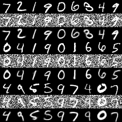

2. [Colorization AutoEncoder](chapter3-autoencoders/colorization-autoencoder-cifar10-3.4.1.py)


Sample outputs for random cifar10 images:

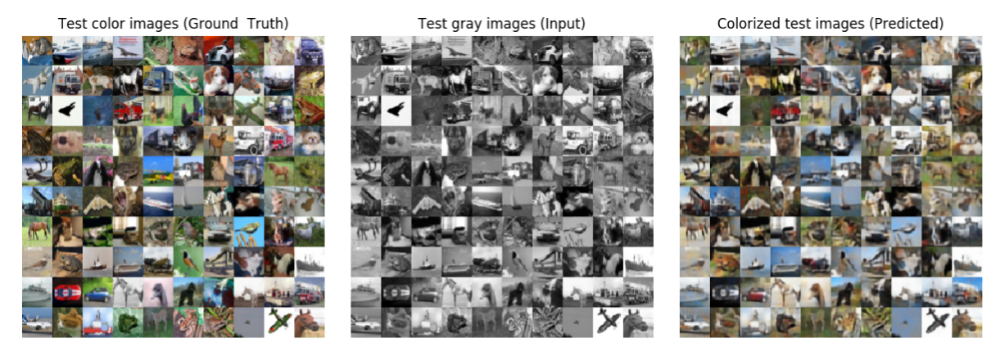
## [Chapter 4 - Generative Adversarial Network (GAN)](chapter4-gan)
1. [Deep Convolutional GAN (DCGAN)](chapter4-gan/dcgan-mnist-4.2.1.py)

[Radford, Alec, Luke Metz, and Soumith Chintala. "Unsupervised representation learning with deep convolutional generative adversarial networks." arXiv preprint arXiv:1511.06434 (2015).](https://arxiv.org/pdf/1511.06434.pdf%C3%AF%C2%BC%E2%80%B0)

Sample outputs for random digits:

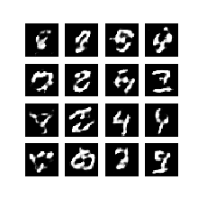

2. [Conditional (GAN)](chapter4-gan/cgan-mnist-4.3.1.py)

[Mirza, Mehdi, and Simon Osindero. "Conditional generative adversarial nets." arXiv preprint arXiv:1411.1784 (2014).](https://arxiv.org/pdf/1411.1784)

Sample outputs for digits 0 to 9:

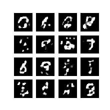
## [Chapter 5 - Improved GAN](chapter5-improved-gan)
1. [Wasserstein GAN (WGAN)](chapter5-improved-gan/wgan-mnist-5.1.2.py)

[Arjovsky, Martin, Soumith Chintala, and Léon Bottou. "Wasserstein GAN." arXiv preprint arXiv:1701.07875 (2017).](https://arxiv.org/pdf/1701.07875)

Sample outputs for random digits:

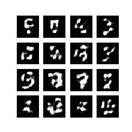

2. [Least Squares GAN (LSGAN)](chapter5-improved-gan/lsgan-mnist-5.2.1.py)

[Mao, Xudong, et al. "Least squares generative adversarial networks." 2017 IEEE International Conference on Computer Vision (ICCV). IEEE, 2017.](http://openaccess.thecvf.com/content_ICCV_2017/papers/Mao_Least_Squares_Generative_ICCV_2017_paper.pdf)

Sample outputs for random digits:

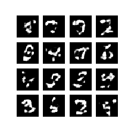

3. [Auxiliary Classifier GAN (ACGAN)](chapter5-improved-gan/acgan-mnist-5.3.1.py)

[Odena, Augustus, Christopher Olah, and Jonathon Shlens. "Conditional image synthesis with auxiliary classifier GANs. Proceedings of the 34th International Conference on Machine Learning, Sydney, Australia, PMLR 70, 2017."](http://proceedings.mlr.press/v70/odena17a.html)

Sample outputs for digits 0 to 9:

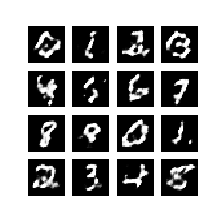
## [Chapter 6 - GAN with Disentangled Latent Representations](chapter6-disentangled-gan)
1. [Information Maximizing GAN (InfoGAN)](chapter6-disentangled-gan/infogan-mnist-6.1.1.py)

[Chen, Xi, et al. "Infogan: Interpretable representation learning by information maximizing generative adversarial nets." 
Advances in Neural Information Processing Systems. 2016.](http://papers.nips.cc/paper/6399-infogan-interpretable-representation-learning-by-information-maximizing-generative-adversarial-nets.pdf)

Sample outputs for digits 0 to 9:

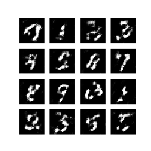

2. [Stacked GAN](chapter6-disentangled-gan/stackedgan-mnist-6.2.1.py)

[Huang, Xun, et al. "Stacked generative adversarial networks." IEEE Conference on Computer Vision and Pattern Recognition (CVPR). Vol. 2. 2017](http://openaccess.thecvf.com/content_cvpr_2017/papers/Huang_Stacked_Generative_Adversarial_CVPR_2017_paper.pdf)

Sample outputs for digits 0 to 9:

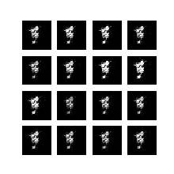

## [Chapter 7 - Cross-Domain GAN](chapter7-cross-domain-gan)
1. [CycleGAN](chapter7-cross-domain-gan/cyclegan-7.1.1.py)

[Zhu, Jun-Yan, et al. "Unpaired Image-to-Image Translation Using Cycle-Consistent Adversarial Networks." 2017 IEEE International Conference on Computer Vision (ICCV). IEEE, 2017.](http://openaccess.thecvf.com/content_ICCV_2017/papers/Zhu_Unpaired_Image-To-Image_Translation_ICCV_2017_paper.pdf)

Sample outputs for random cifar10 images:


Sample outputs for MNIST to SVHN:

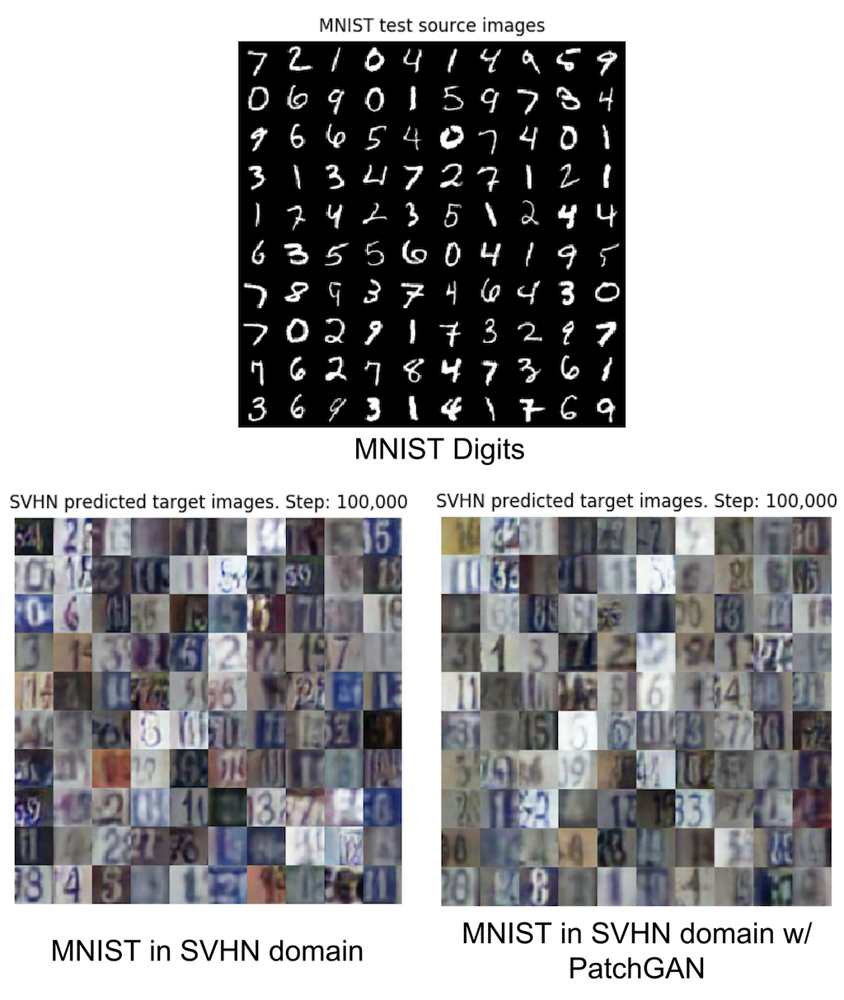

## [Chapter 8 - Variational Autoencoders (VAE)](chapter8-vae)

1. [VAE MLP MNIST](chapter8-vae/vae-mlp-mnist-8.1.1.py)
2. [VAE CNN MNIST](chapter8-vae/cvae-cnn-mnist-8.2.1.py)
3. [Conditional VAE and Beta VAE](chapter8-vae/cvae-cnn-mnist-8.2.1.py)

[Kingma, Diederik P., and Max Welling. "Auto-encoding Variational Bayes." arXiv preprint arXiv:1312.6114 (2013).](https://arxiv.org/pdf/1312.6114.pdf)

[Sohn, Kihyuk, Honglak Lee, and Xinchen Yan. "Learning structured output representation using deep conditional generative models." Advances in Neural Information Processing Systems. 2015.](http://papers.nips.cc/paper/5775-learning-structured-output-representation-using-deep-conditional-generative-models.pdf)

[I. Higgins, L. Matthey, A. Pal, C. Burgess, X. Glorot, M. Botvinick, S. Mohamed, and A. Lerchner. β-VAE: Learning basic visual concepts with a constrained variational framework. ICLR, 2017.](https://openreview.net/pdf?id=Sy2fzU9gl)

Generated MNIST by navigating the latent space:

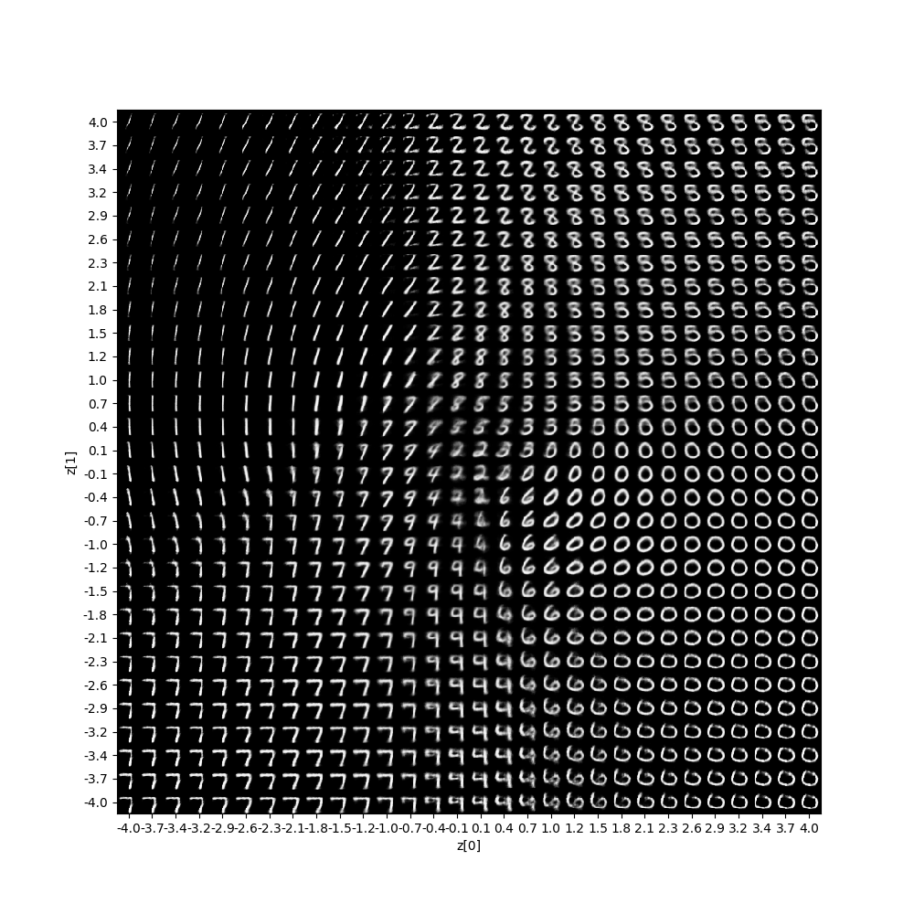

## [Chapter 9 - Deep Reinforcement Learning](chapter9-drl)

1. [Q-Learning](chapter9-drl/q-learning-9.3.1.py)
2. [Q-Learning on Frozen Lake Environment](chapter9-drl/q-frozenlake-9.5.1.py)
3. [DQN and DDQN on Cartpole Environment](chapter9-drl/dqn-cartpole-9.6.1.py)

Mnih, Volodymyr, et al. "Human-level control through deep reinforcement learning." Nature 518.7540 (2015): 529

DQN on Cartpole Environment:

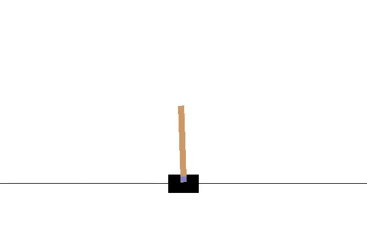

## [Chapter 10 - Policy Gradient Methods](chapter10-policy)

1. [REINFORCE, REINFORCE with Baseline, Actor-Critic, A2C](chapter10-policy/policygradient-car-10.1.1.py)

[Sutton and Barto, Reinforcement Learning: An Introduction ](http://incompleteideas.net/book/bookdraft2017nov5.pdf)

[Mnih, Volodymyr, et al. "Asynchronous methods for deep reinforcement learning." International conference on machine learning. 2016.](http://proceedings.mlr.press/v48/mniha16.pdf)


Policy Gradient on MountainCar Continuous Environment:

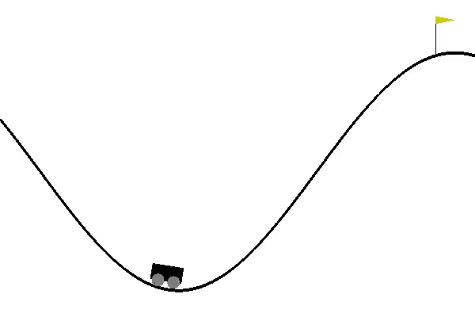


## [Chapter 11 - Object Detection](chapter11-detection)

1. [Single-Shot Detection](https://arxiv.org/pdf/1512.02325.pdf)

Single-Shot Detection on 3 Objects


## [Chapter 12 - Semantic Segmentation](chapter12-segmentation)

1. [FCN](https://www.cv-foundation.org/openaccess/content_cvpr_2015/papers/Long_Fully_Convolutional_Networks_2015_CVPR_paper.pdf)

2. [PSPNet](http://openaccess.thecvf.com/content_cvpr_2017/papers/Zhao_Pyramid_Scene_Parsing_CVPR_2017_paper.pdf)

Semantic Segmentation

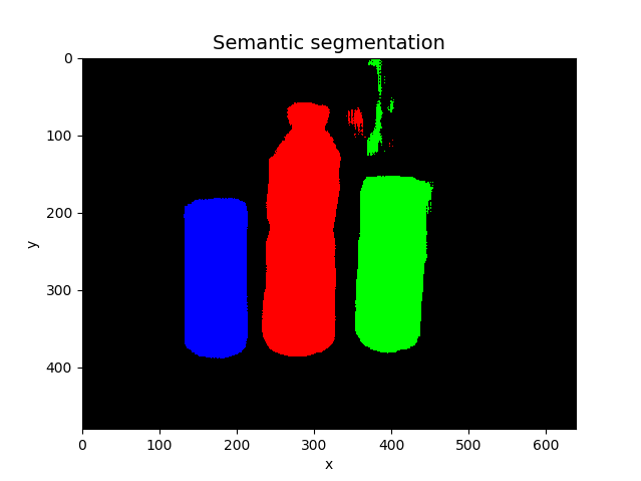

## [Chapter 13 - Unsupervised Learning using Mutual Information](chapter13-mi-unsupervised)


1. [Invariant Information Clustering](http://openaccess.thecvf.com/content_ICCV_2019/papers/Ji_Invariant_Information_Clustering_for_Unsupervised_Image_Classification_and_Segmentation_ICCV_2019_paper.pdf)

2. [MINE: Mutual Information Estimation](http://proceedings.mlr.press/v80/belghazi18a/belghazi18a.pdf)


MINE
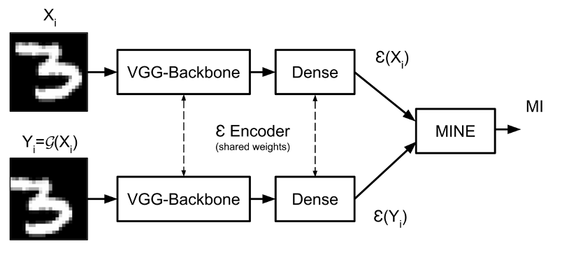

## Citation
If you find this work useful, please cite:

```
@book{atienza2020advanced,
  title={Advanced Deep Learning with TensorFlow 2 and Keras: Apply DL, GANs, VAEs, deep RL, unsupervised learning, object detection and segmentation, and more},
  author={Atienza, Rowel},
  year={2020},
  publisher={Packt Publishing Ltd}
}
```

