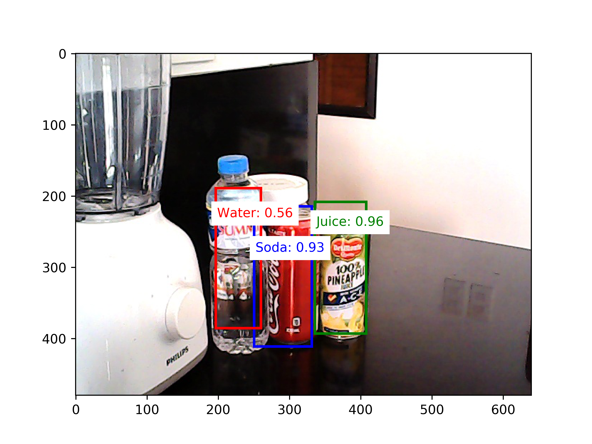
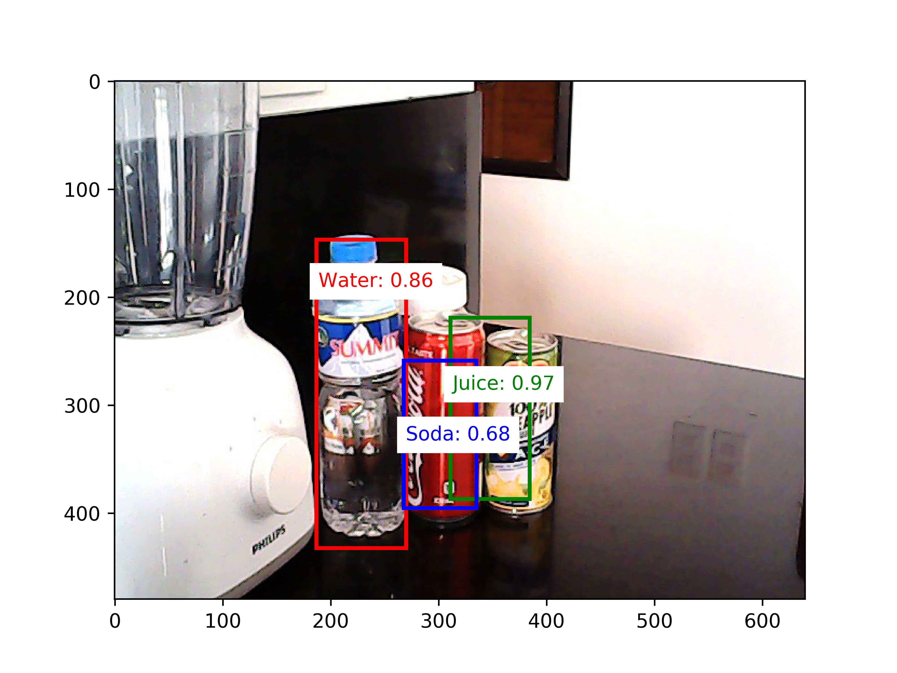
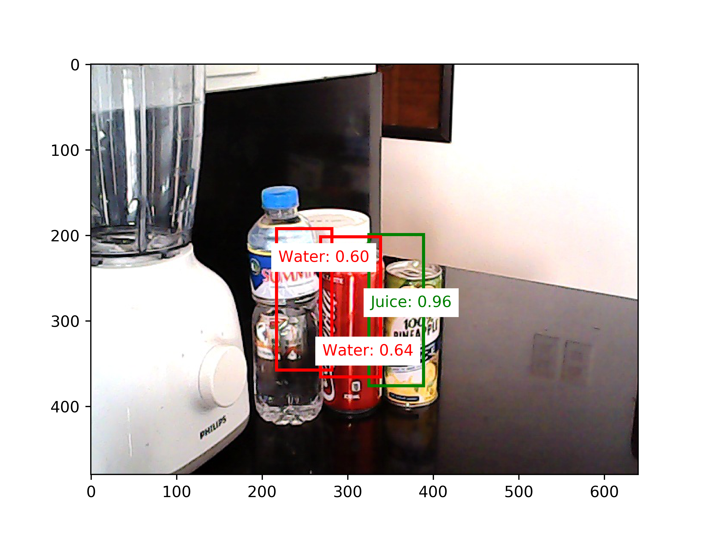
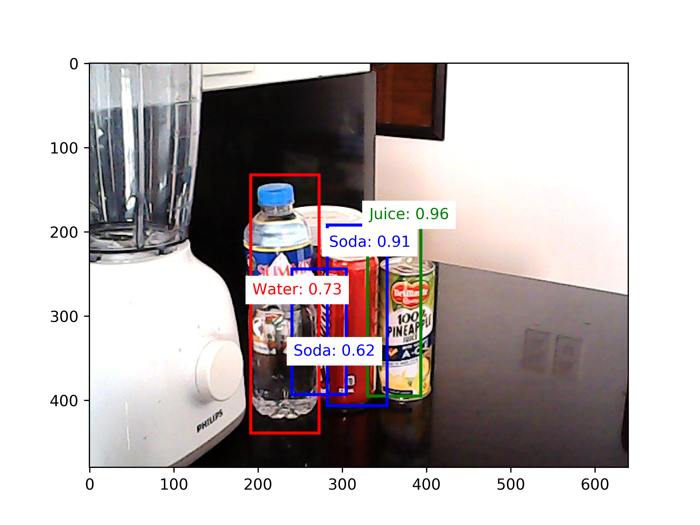

## Chapter 11 - Object Detection

Figure 11.13.1 Example predictions on an image from the test dataset (unnormalized offsets)

Figure 11.13.2 Example predictions on an image from the test dataset (unnormalized offsets, smooth L1)

Figure 11.13.3 Example predictions on an image from the test dataset (normalized offsets)

Figure 11.13.4 Example predictions on an image from the test dataset (normalized offsets, smooth L1)

Figure 11.13.5 Example predictions on an image from the test dataset (normalized offsets, smooth L1, focal loss)
