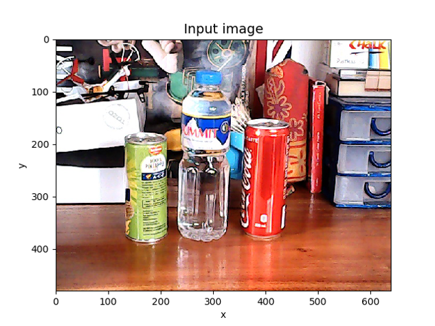
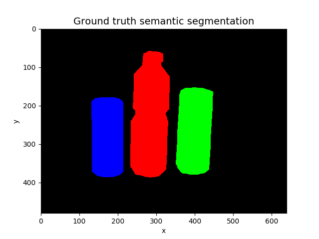

## Chapter 12 - Semantic Segmentation

Figure 12.5.3 Sample input for semantic segmentation. 

Figure 12.5.3 Sample ground truth for semantic segmentation. 

Figure 12.5.3 Sample prediction for semantic segmentation. 
We assigned black color for background class instead of purple as earlier used.
