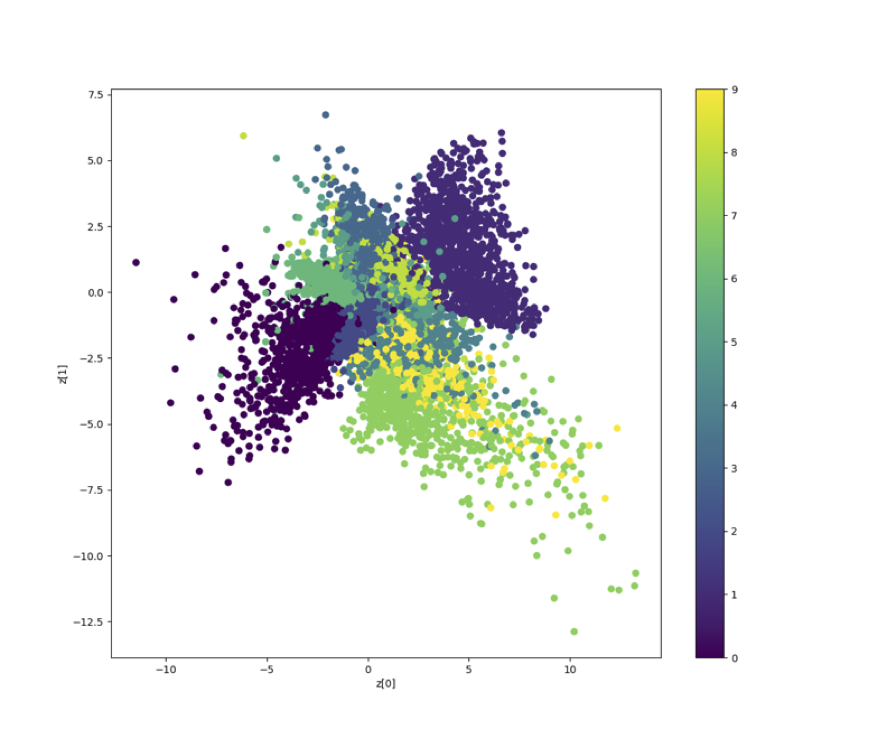
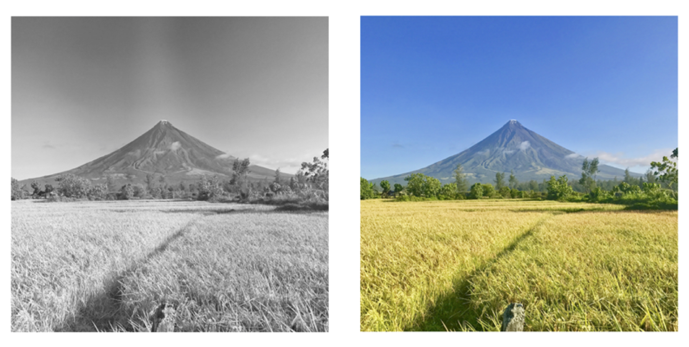
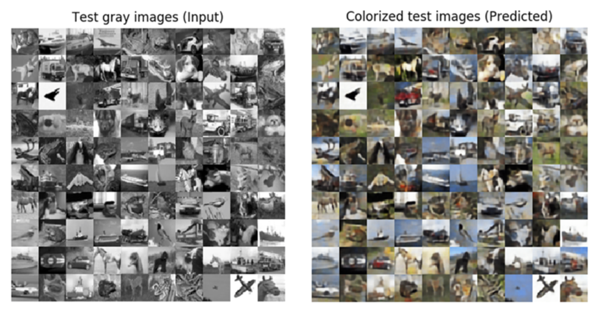
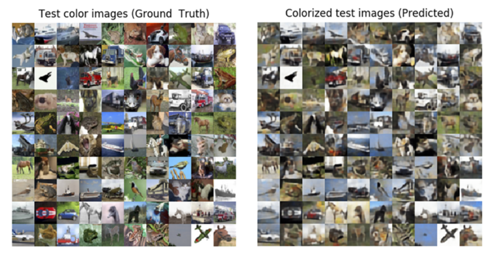

## Chapter 3 - AutoEncoders

Figure 3.2.5: A MNIST digit distribution as a function of latent code dimensions, z[0] and z[1]

Figure 3.4.1: Adding color to a grayscale photo of the Mayon Volcano. A colorization network should replicate human abilities by adding color to a grayscale photo. Left photo is grayscale. 

Figure 3.4.2: Automatic grayscale to color image conversion using the autoencoder. CIFAR10 test grayscale input images (left) and predicted color images (right).

Figure 3.4.3: Side by side comparison of ground truth color images and predicted colorized images.
