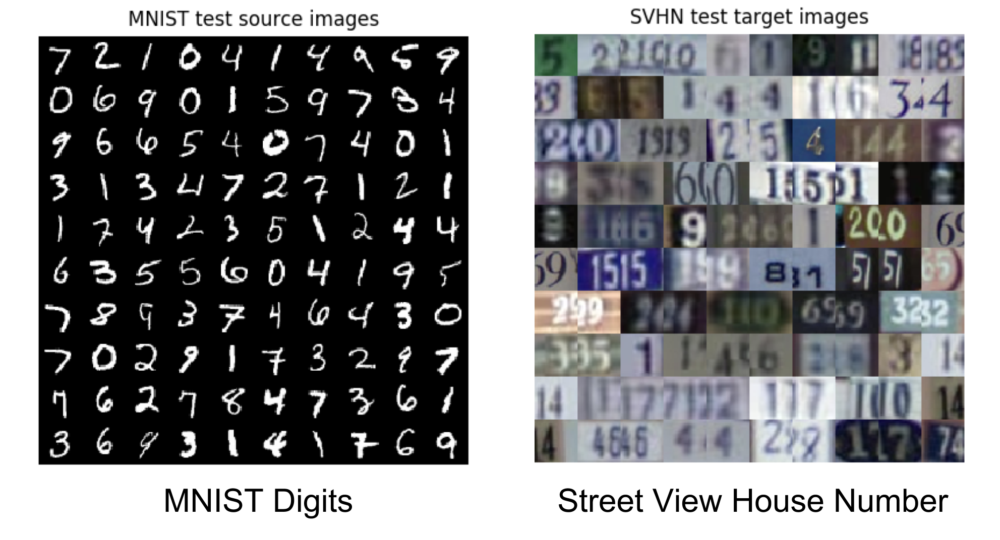
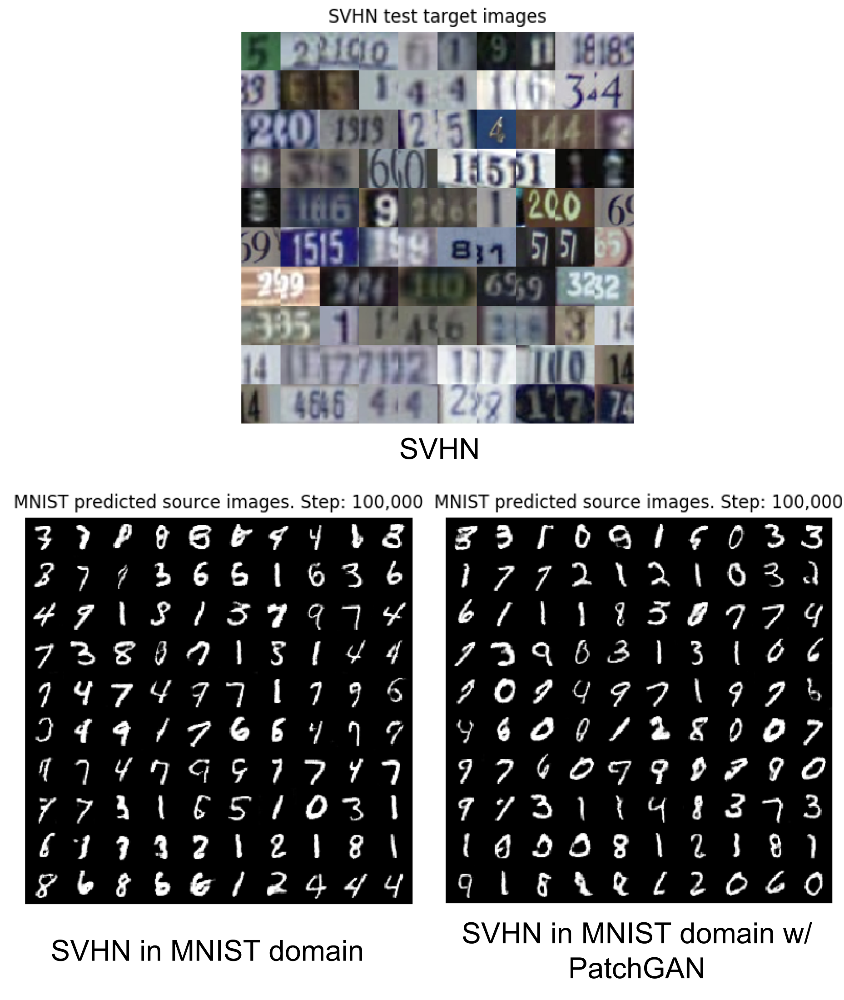
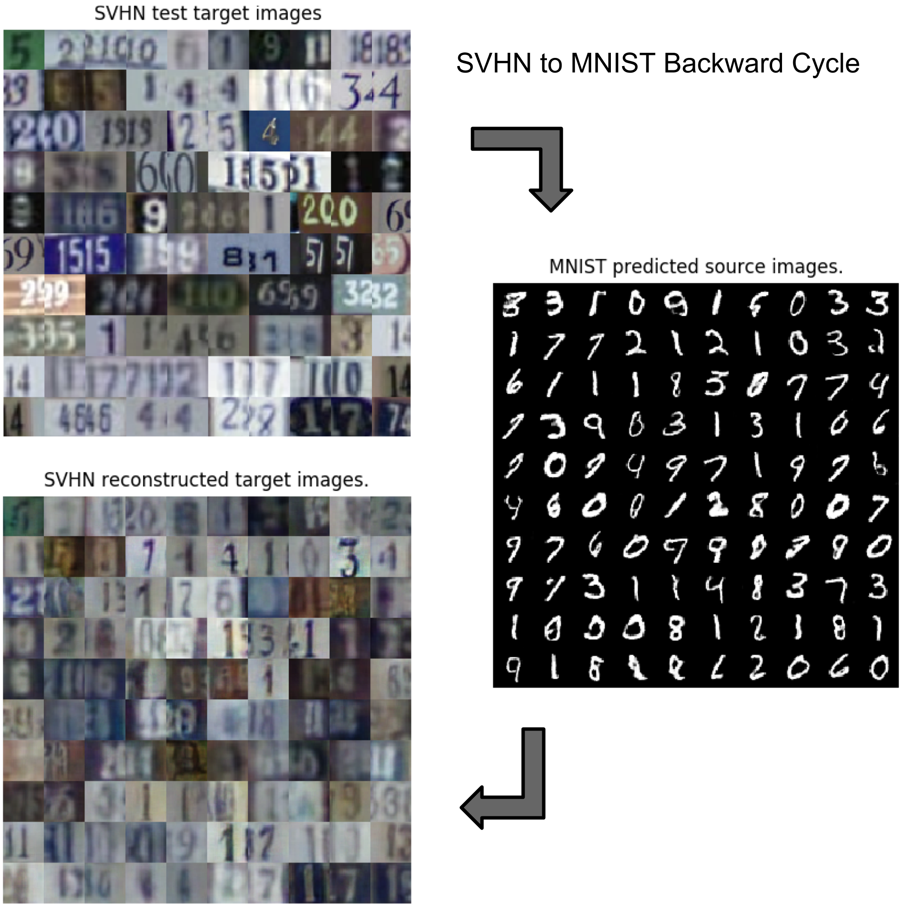

## Chapter 7 - Cross-Domain GAN

Figure 7.1.9: Colorization using different techniques. Shown are the ground truth, colorization using autoencoder (Chapter 3, Autoencoders,), colorization using CycleGANs with a vanilla GAN discriminator, and colorization using CycleGAN with PatchGAN discriminator.
___

Figure 7.1.11: Two different domains with data that are not aligned
___

Figure 7.1.12: Style transfer of test data from the MNIST domain to SVHN.
___

Figure 7.1.13: Style transfer of test data from SVHN domain to MNIST.
___

Figure 7.1.14: Forward cycle of CycleGAN with PatchGAN on MNIST (source) to SVHN (target). The reconstructed source is similar to the original source.
___

Figure 7.1.15: The backward cycle of CycleGAN with PatchGAN on MNIST (source) to SVHN (target). The reconstructed target is not entirely similar to the original target.
___
