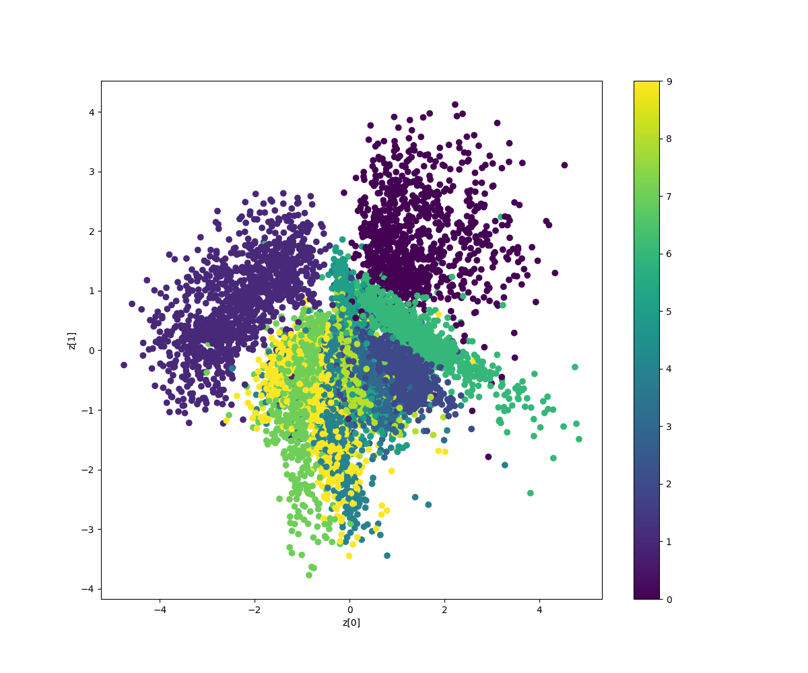
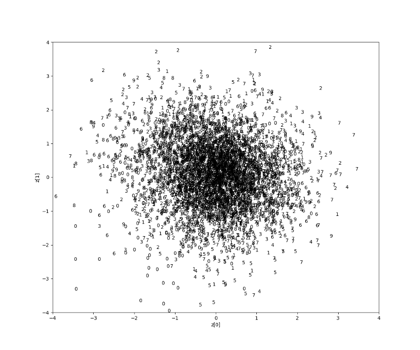
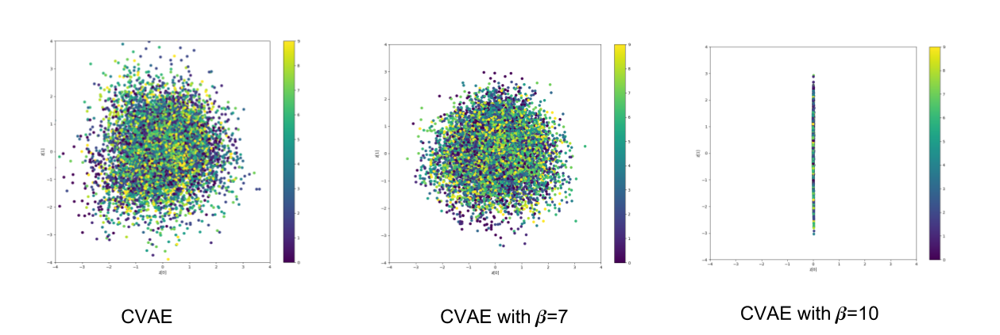

## Chapter 8 - Variational Autoencoders

Figure 8.1.6 Latent vector mean values for test dataset (VAE MLP). The colorbar shows the corresponding MNIST digit as a function of z.

Figure 8.1.11 Latent vector mean values for test dataset (VAE CNN). The colorbar shows the corresponding MNIST digit as a function of z.

Figure 8.2.4 Latent vector mean values for test dataset (CVAE CNN). The colorbar shows the corresponding MNIST digit as a function of z.

Figures 8.3.1 and 8.3.2 Latent vector mean values for test dataset (β-VAE with β=1), (β-VAE with β=7) and (β-VAE with β=10)
